# instalção elétrica do robô

toda a fiação segue o [esquema elétrico]() em anexo. Abaixo estão as instruções de instalação.

## Instalação do sistema 20 V da base móvel.

Comece com o conector da bateria 20 V, conectando o positivo do cabo de saída (em azul) no cabo que leva energia ao fusível e ao botão de emergência. Conecte uma extensão ao fio negativo. É recomendável utilizar conectores Wago.

Passe o cabo positivo que volta do botão de emergência junto com o fio negativo extensor através da gaiola entre motor e caixa de redução, conforme foto.

| Layout dos cabos | Conexão de energia principal |
|----------|----------|
| 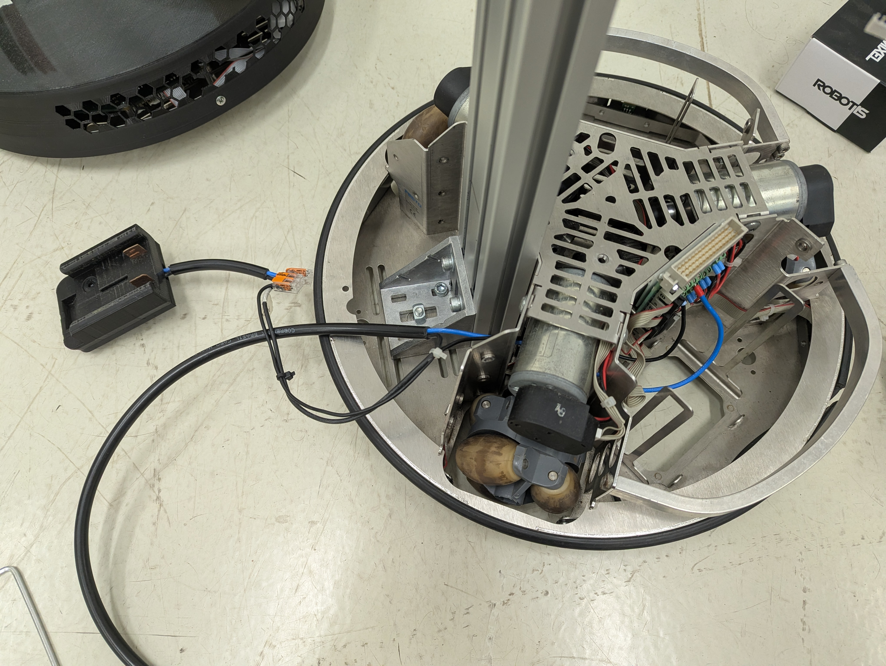 | 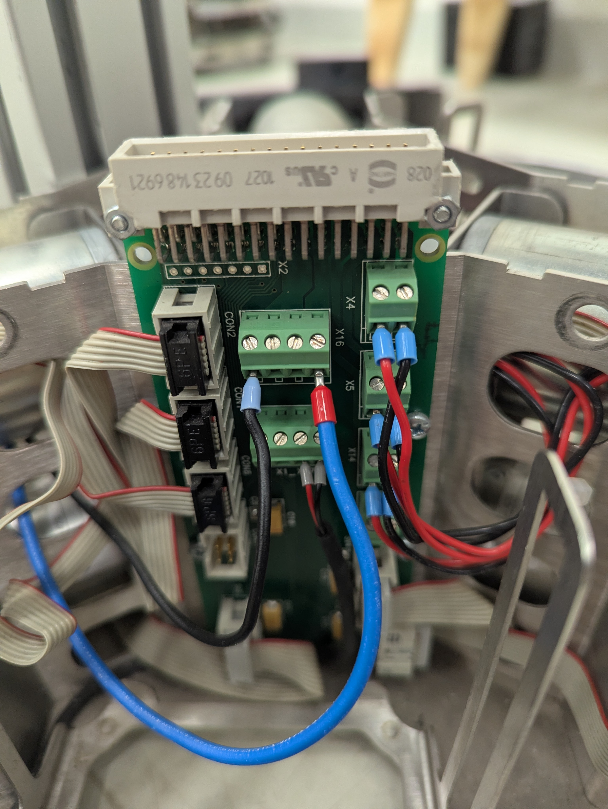 |

Parafuse o conector da bateria de 20 V, e então reinstale a unidade de controle + LiDAR em cima do robô, apertando os parafusos.

## Instalação dos cabos de comunicação

Abra a unidade de controle e conecte o cabo USB lo LiDAR, certificando a segura fixação dos cabos, para evitar desconexões acidentais ou danos aos conectores das placas.

| conexão do cabo USB | Proteção do cabo |
|----------|----------|
| 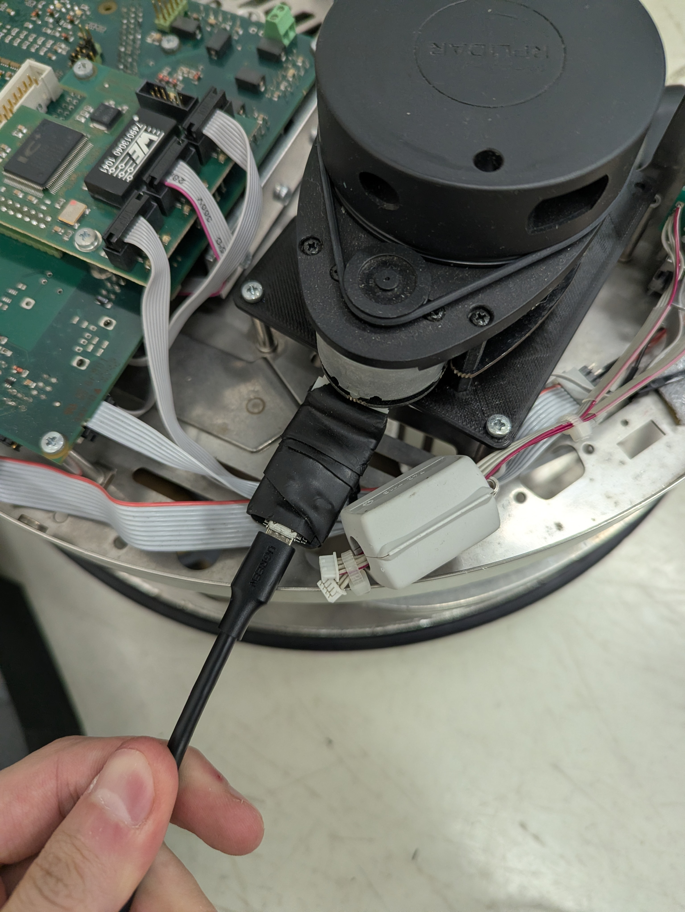 | 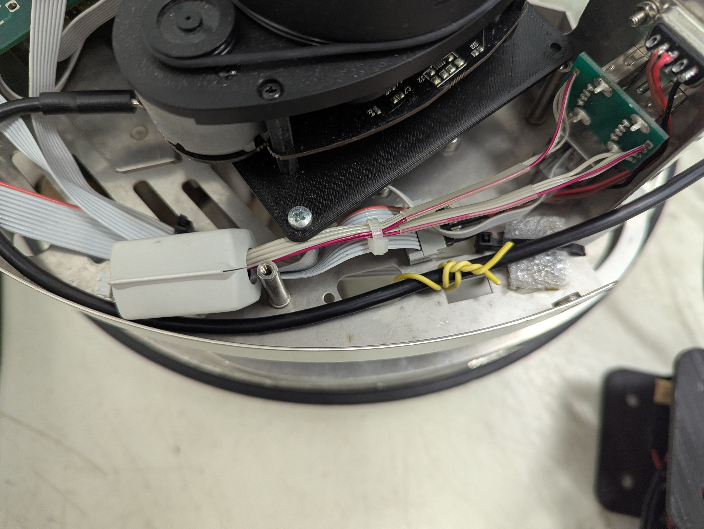 |

Feche a unidade e conecte o adaptador RS-232 da placa EA-09 e também os conectores de entrada/saída da placa EA-09

| conexão do cabo RS-232 | Conector entrada/saída |
|----------|----------|
| 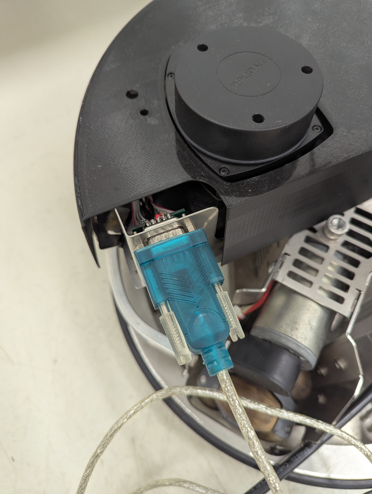 | 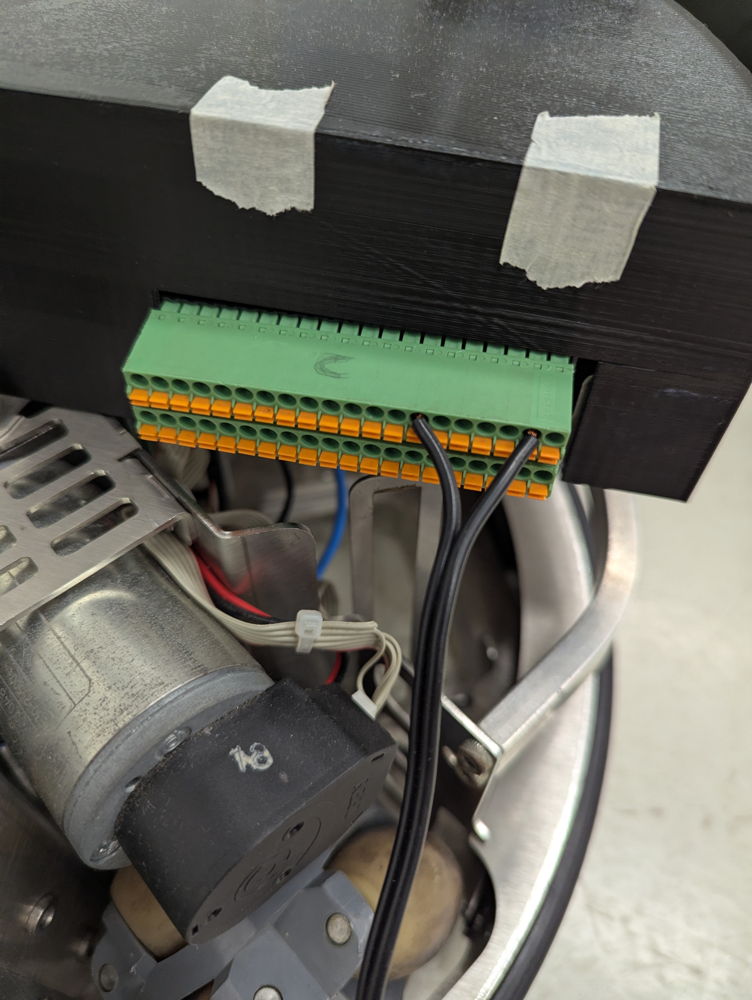 |

## Passando os cabos pela estrutura do robô

Para garantir uma boa organização dos cabos, é recomendável passar os mesmos da seguinte maneira:

1. Coloque o cabo USB e RS-232 dentro do slot T, de maneira a ficar um pouco justo, mas não prensar o cabo

2. Passe o cabo de força no centro do slot T, fixando os cabos. Este cabo deve entrar com um pouco de atrito e ficar fixo dentro do canal. Faça o movimento de baixo para cima, garantindo o posicionamento dos  outros cabos.

| Etapa 1 | Etapa 2 |
|----------|----------|
| 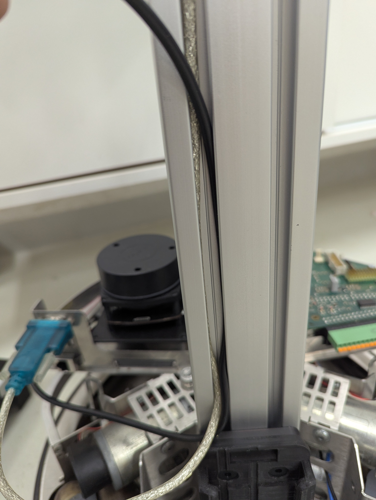 | 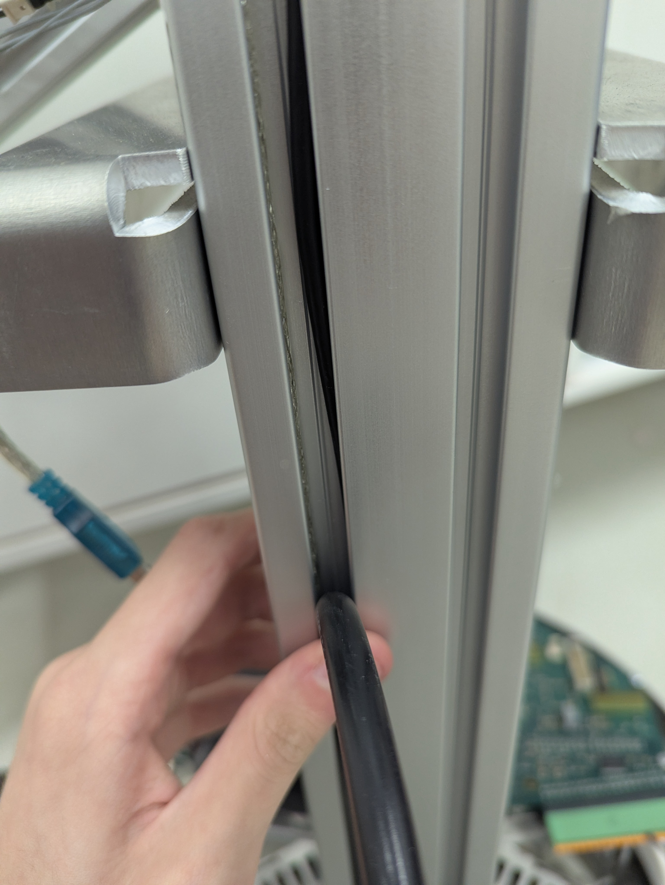 |

No topo, coloque a base do notebook (sem fixar, para deixar a distancia correta) e encaixe a caixa do botão de emergência com sinaleiro. Depois, passe o outro cabo de potência do braço para baixo, junto com o fio do sinaleiro.

| Caixa do botão de emergência com sinaleiro | Final do cabo de energia do braço com o fio do sinaleiro |
|----------|----------|
| 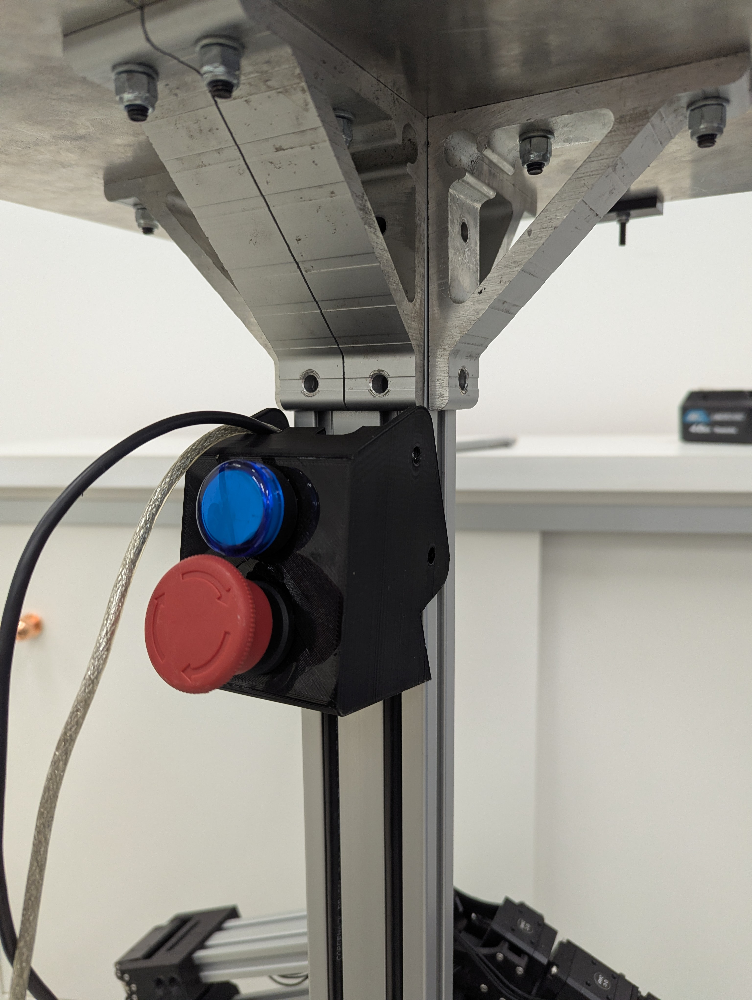 | 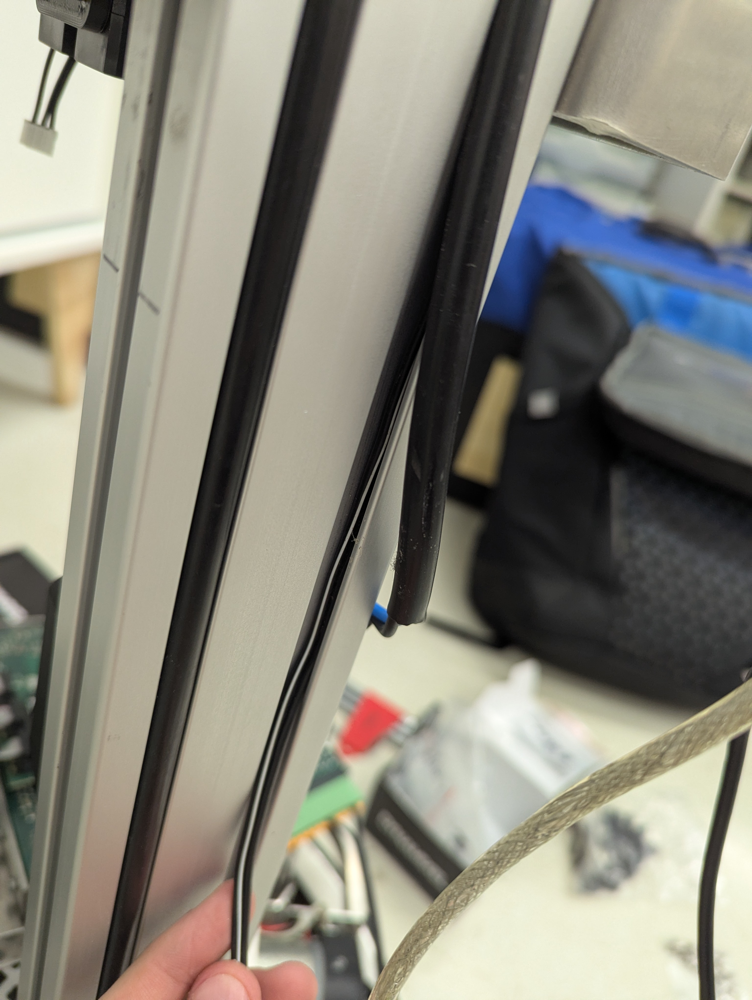 |

Fixe a caixa do botão de emergência com dois parafusos M6x12 com arrouelas.
> [!TIP]
> Apenas os dois parafusos superiores seguram a caixa. Houve um erro no design inicial da peça que não foi corrigido por falta de tempo e ela ficou pequena por alguns milímetros. Iteração necessária para próximas versões.

## instalação elétrica do braço

1. Fixe o suporte da bateria 12 V debaixo do suporte do braço
2. Coloque o suporte da placa de distribuição de energia U2D2 com sua parte mais comprida para baixo
3. instale a placa de distribuição (parafusos M3) e os cabos de energia do U2D2

| Etapa 1 | Etapa 2 | Etapa 3 |
|----------|----------|----------|
| 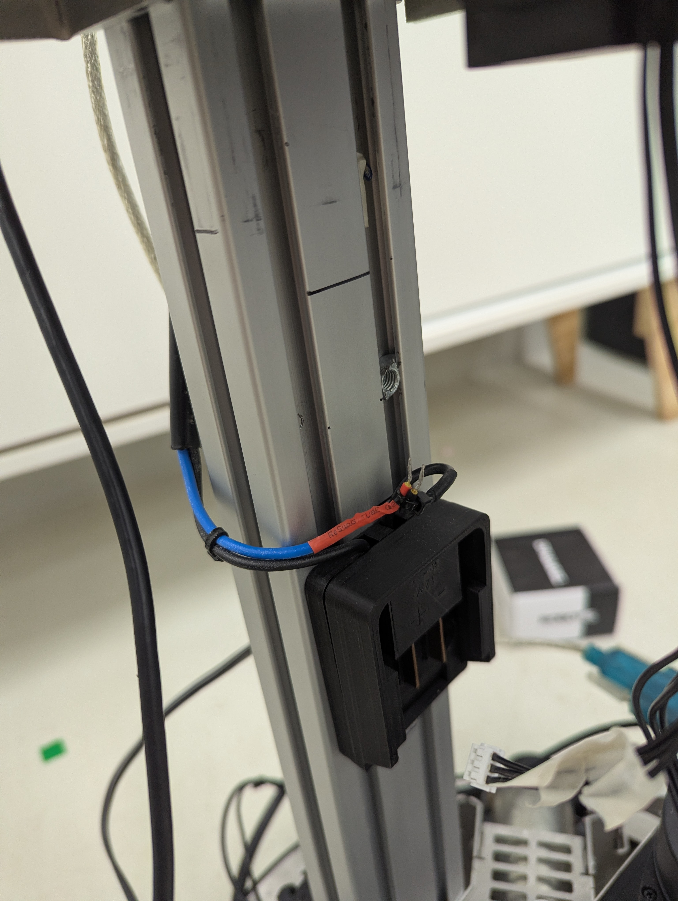 | 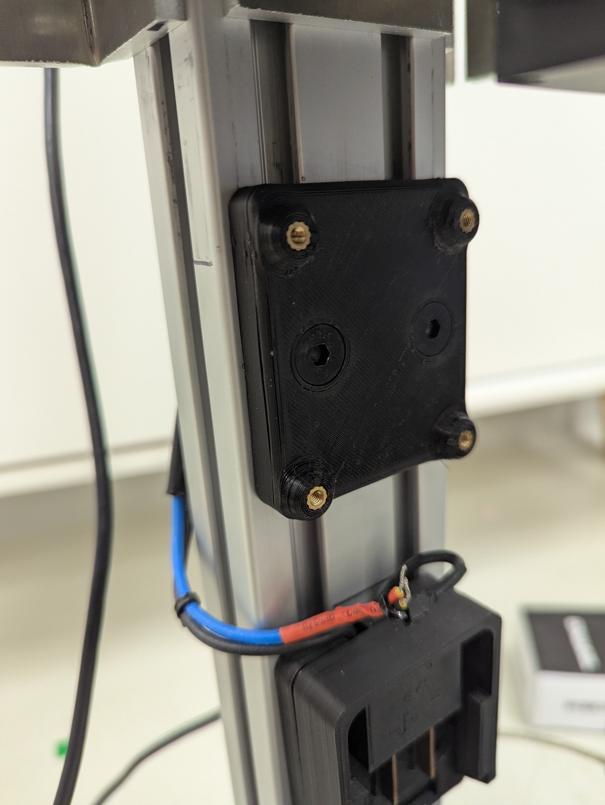 | 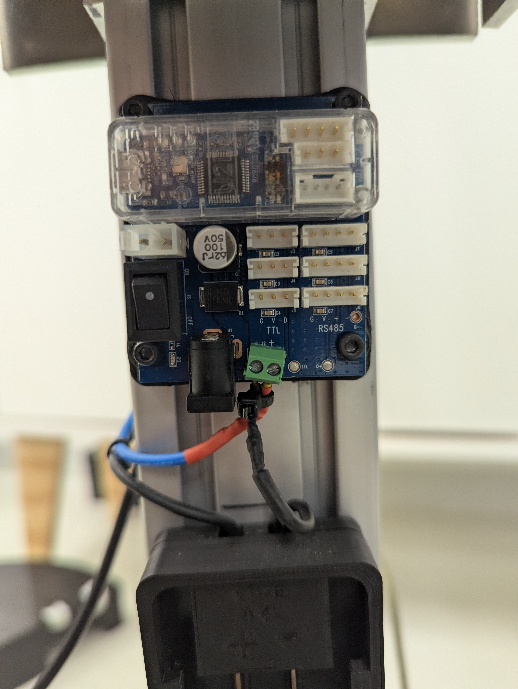 |

Elétrica pronta!