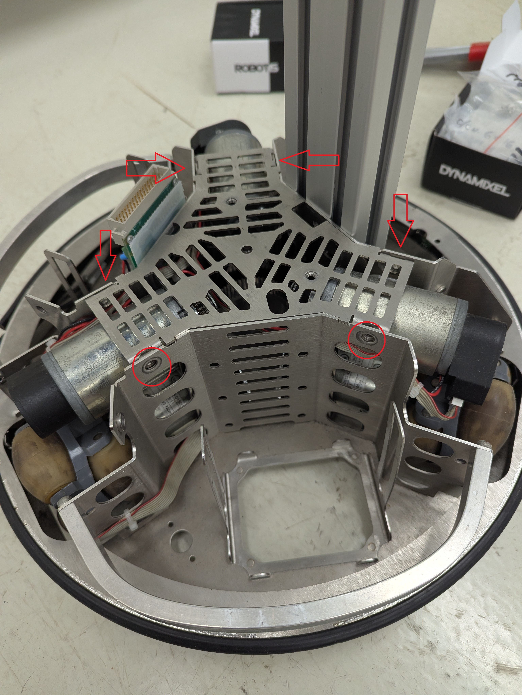
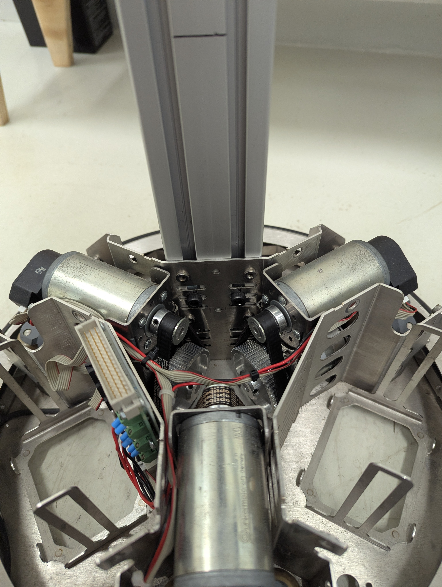
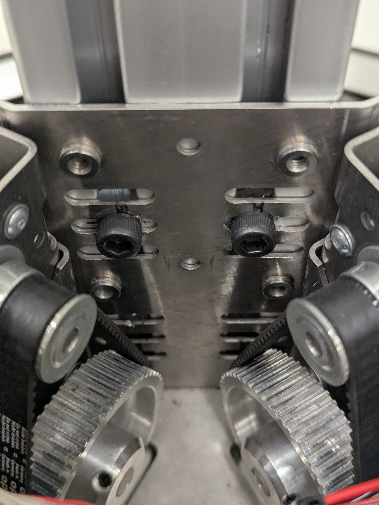
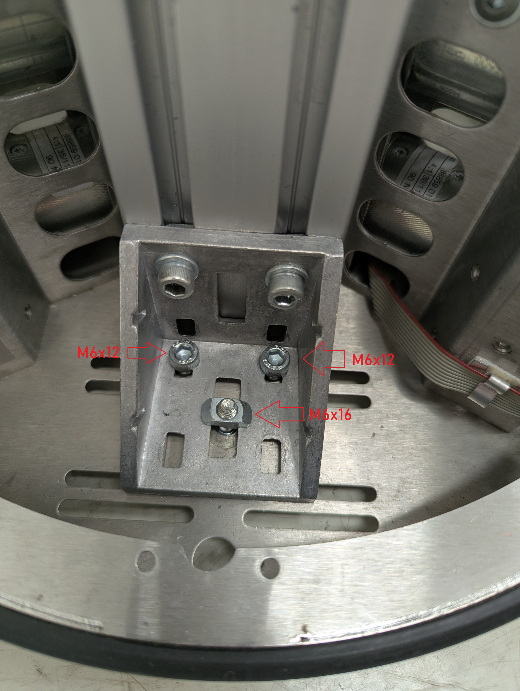
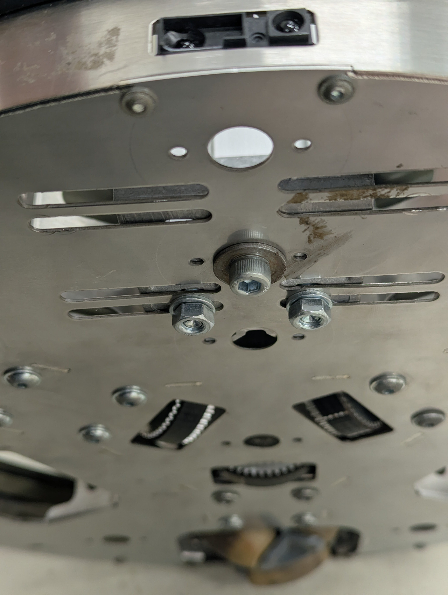

# Como instalar a barra principal

1. Remova o computaor superior soltando os parafusos.

2. Remova os parafusos da tampa superior do Robotino

3. Instale dois parafusos M6x8

| Remova a tampa | Instale os parafusos M6x8|
|----------|----------|
|||

4. Coloque o L externo

| Vista superior | Vista inferior |
|----------|----------|
|||
