# montagem mecânica do braço

> [!CAUTION]
> Confira múltiplas vezes o tamanho dos parafusos. Nunca force nenhum componente mecânico, todas as peças devem se encaixar com facilidade. Confira o tamanho dos parafusos com o [manual do dynamixel](https://emanual.robotis.com/docs/en/dxl/x/xm540-w270/) do respectivo componente.

o braço é composto de várias partes independentes, estas sendo:
- garra (gripper)
- pulso cima/baixo (wrist angle)
- pulso rotação (wrist rotate)
- cotovelo (elbow)
- ombro (shoulder)
- base rotativa ou cintura (waist)

## fixação da base

Fixe a base com 4 parafusos M6x12 com arruelas, como demonstrado na imagem.

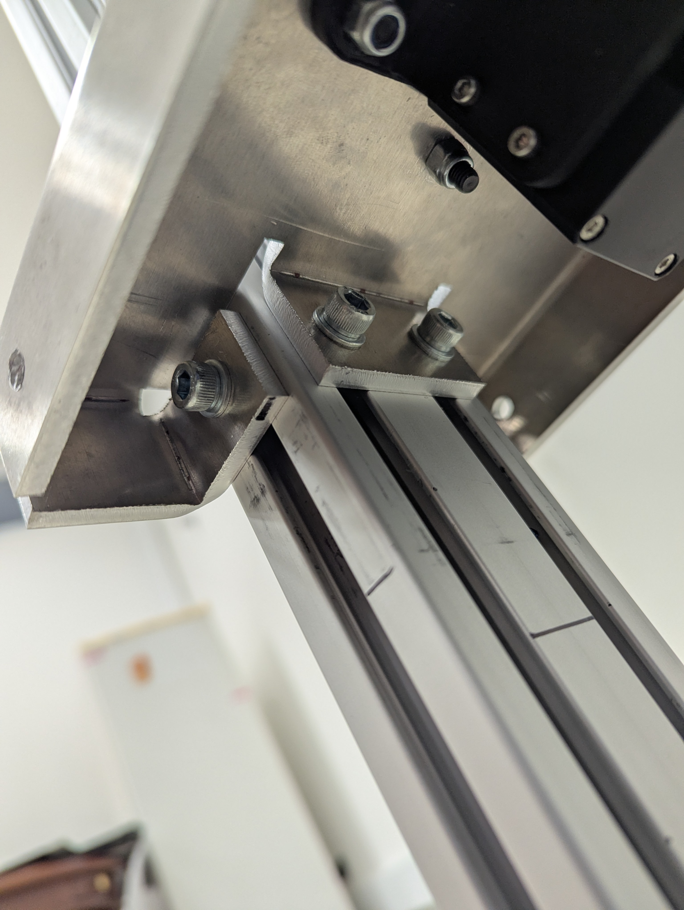

Parafuse o rolamento principal com 6 parafusos M5x25 e porcas travantes com arruelas, segurando o motor dynamixel inferior (utilize parafusos M3x8).

Parafuse a base da cintura na parte rotativa do braço, passando pela parte plástica que conecta o dynamixel inferior, demonstrado na imagem.

| Parafuso M5x25 |
|----------|
| 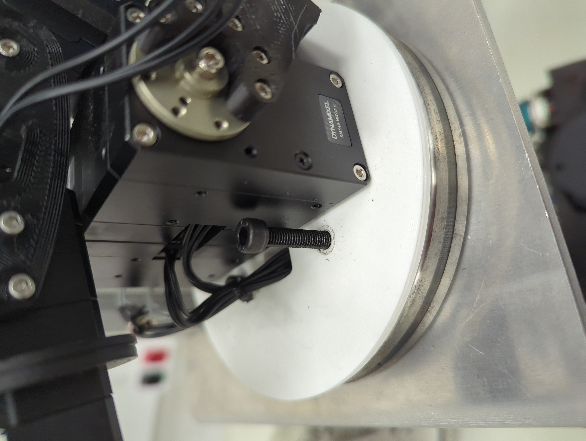 |

## Ombro

Utilize 10 parafusos M2.5x6 para fixar os dois lados separados. Alinhe as duas marcações de ponto com a extrusão de alumínio

| Parafuso M2.5x6 |
|----------|
| 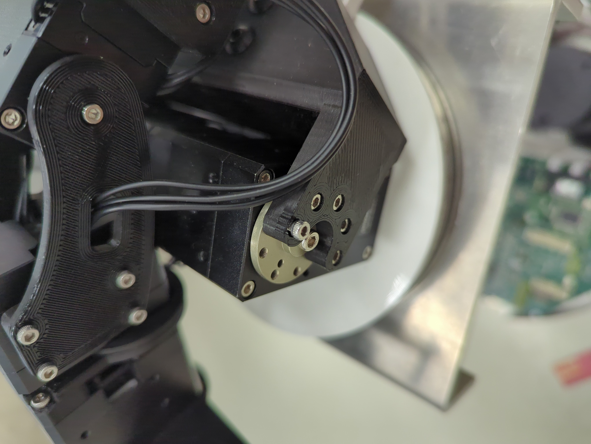 |

## Cotovelo

para prender o motor na estrutura, utilize 4 parafusos Parafuso M2.5x20 + espaçador plástico, conforme manual dos dynamixels.

Para a parte atuada pelo motor do cotovelo, coloque o rolamento F6701ZZ na peça e encaixe na traseira do motor.

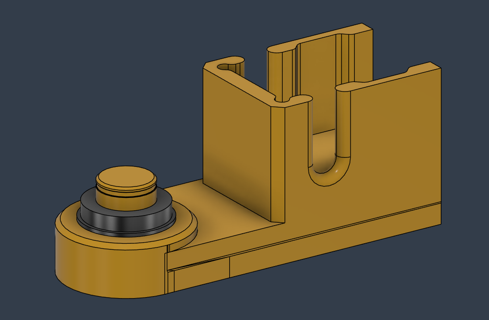

| Parafuso M2.5x20 + espaçador plástico | Parafuso M2.5x8 |
|----------|----------|
| 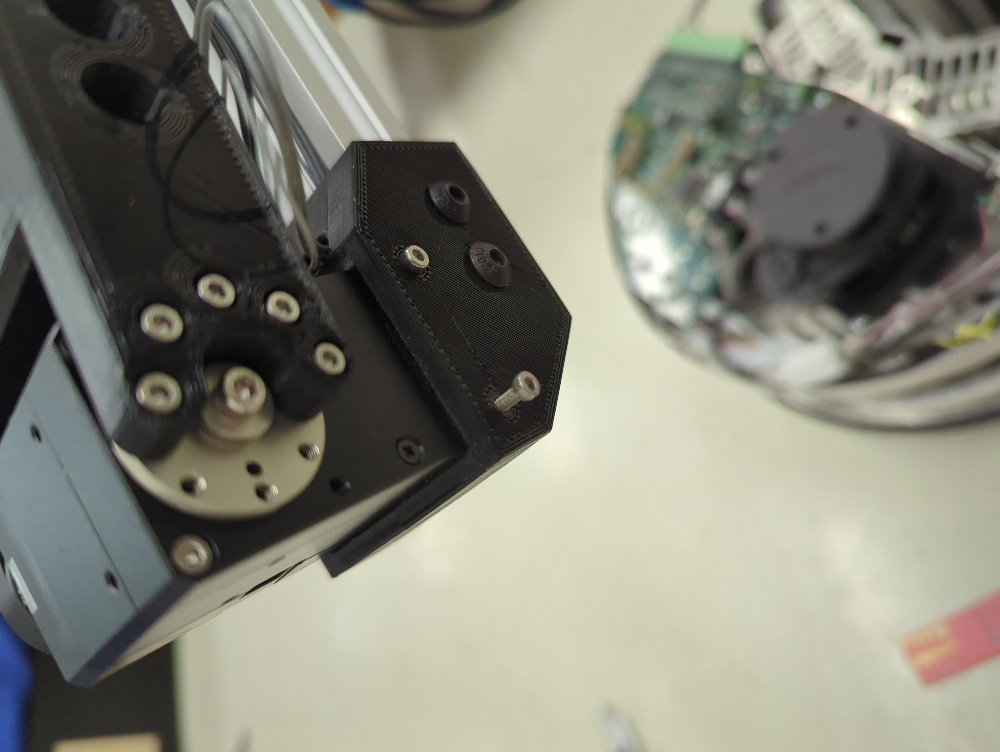 | 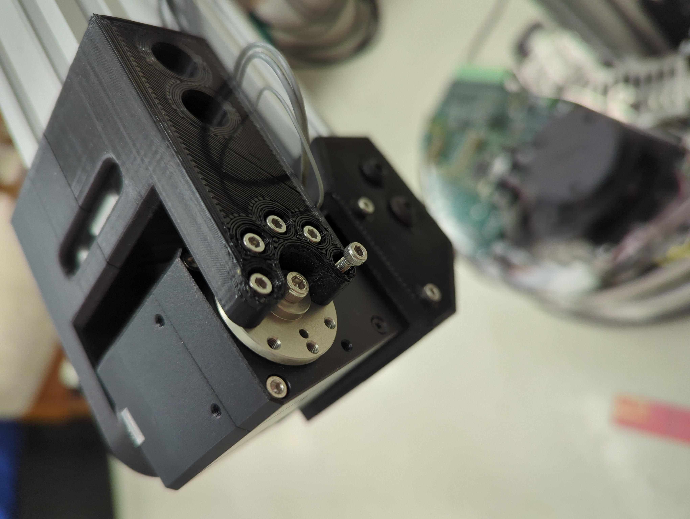 |

## Pulso (ângulo cima/baixo)

Prenda a base do motor, utilizando os espaçadores plásticos conforme o manual diz, com parafusos M2.5x20

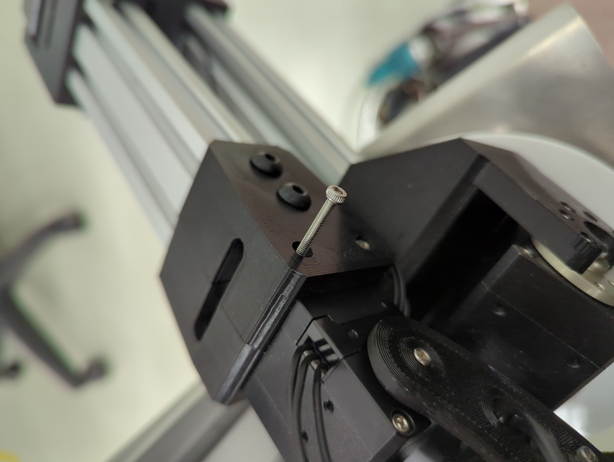

A peça no lado livre do motor deve ser montada com Parafuso M2.5x12 e porca M2.5 não travante (colocar trava rosca) também pode ser colocada uma pequena shim de papel para facilitar a rotação do rolamento F686ZZ.

| Renderização peça | Peças antes da montagem | instalação |
|----------|----------|----------|
| 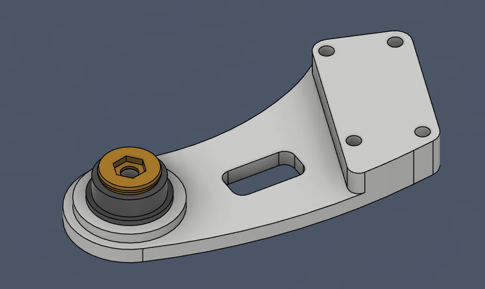 | 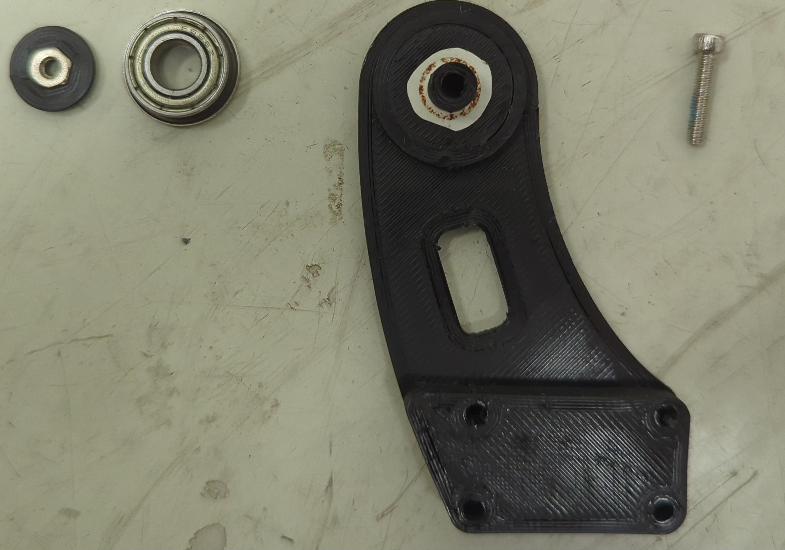 | 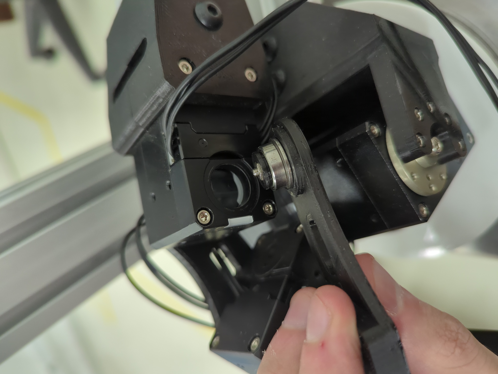 |

Prenda o motor de rotação de pulso com parafusos M2.5x10 dos dois lados.
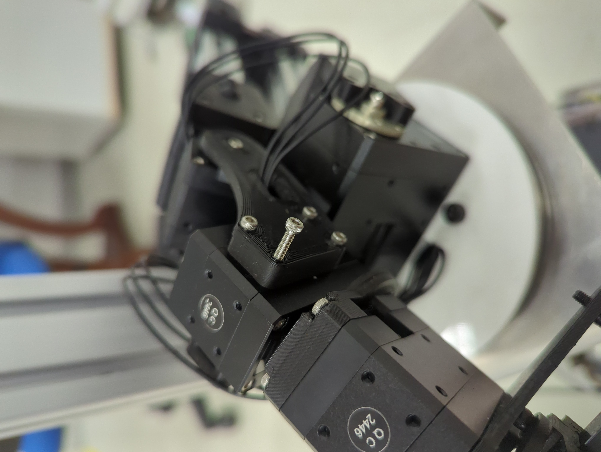

do outro lado, utilize parafusos M2x6
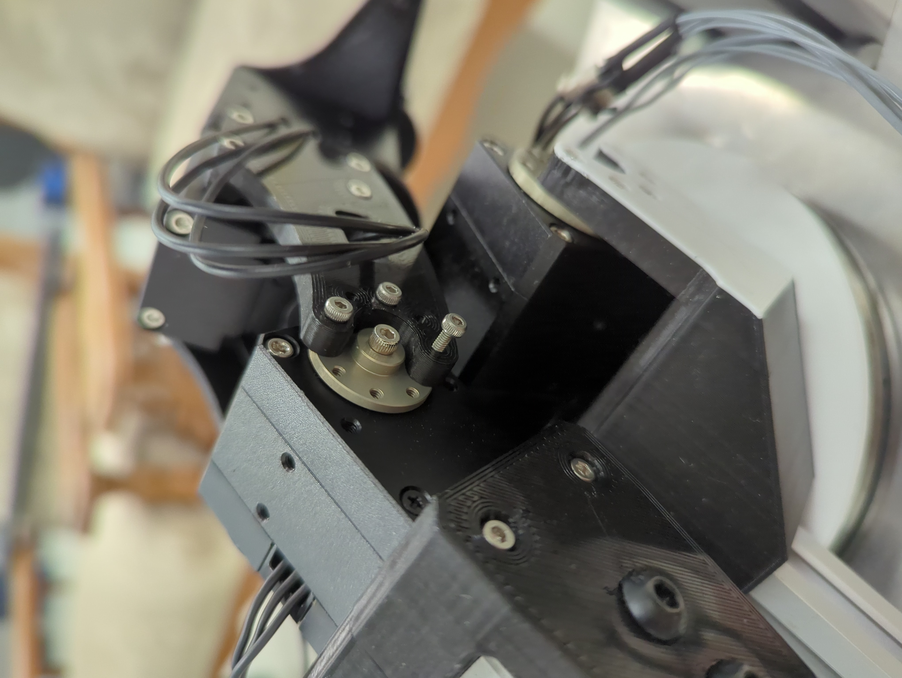

## Pulso (rotação)

